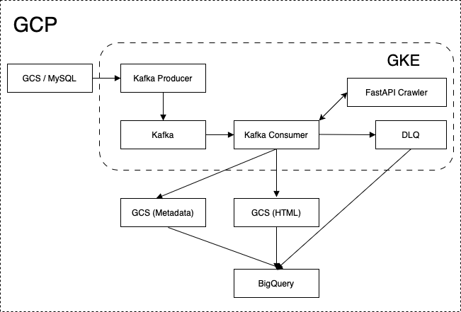

# SEO Metadata & Content Crawler – Part 2 Design Document 

## Table of Contents

1. [ Objective](#1-objective)
2. [ Cloud Platform](#2-cloud-platform)
3. [ Architecture Overview](#3-architecture-overview)
4. [ Input Sources](#4-input-sources)
5. [ Ingestion & Kafka Architecture](#5-ingestion--kafka-architecture)
6. [ URL Processing: Kafka Consumer + FastAPI](#6-url-processing-kafka-consumer--fastapi)
7. [ Output Storage & Batching Strategy](#7-output-storage--batching-strategy)
8. [ GKE Deployment Overview](#8-gke-deployment-overview)
9. [ Unified Data Schema (BigQuery + ClickHouse)](#9-unified-data-schema-bigquery--clickhouse)
10. [ Storage Strategy & Cost Optimization](#10-storage-strategy--cost-optimization)
11. [ SLOs and SLAs](#11-slos-and-slas)
12. [ Cost, Performance & Scale](#12-cost-performance--scale)
13. [ Reliability Strategy](#13-reliability-strategy)
14. [ Metrics Strategy and Reliability Considerations](#14-metrics-strategy-and-reliability-considerations)
15. [ Conclusion](#15-conclusion)


## 1. Objective

Operationalize the scalable collection and storage of **billions of URLs per domain per month** (e.g., amazon.com, walmart.com, bestbuy.com) to extract and store metadata and content using a unified schema. Ensure configurability, respect for robots.txt, scalability, cost-efficiency, and robust monitoring.

---

## 2. Cloud Platform

This design is implemented on **Google Cloud Platform (GCP)** and leverages the following managed and containerized services:

- **GCS (Cloud Storage)** – for scalable object storage of HTML and batch outputs
- **BigQuery** – for fast analytical queries and dashboards
- **GKE (Google Kubernetes Engine)** – for running scalable crawling and Kafka services
- **Cloud SQL** – for storing ingestion metadata and audit logs
- **Artifact Registry** – (optional) for image storage

---

## 3. Architecture Overview



---


## 4. Input Sources

| Source     | Format                | Example Path / Query |
|------------|------------------------|-----------------------|
| Text Files | `.txt.gz`              | `gs://seo-inputs/year=2025/month=07/domain=amazon.com/urls-*.txt.gz` |
| MySQL (Cloud SQL) | One row/file metadata  | `SELECT gcs_path, domain, year, month FROM input_files WHERE ingested = FALSE` |

---

## 5. Ingestion & Kafka Architecture

Each Kafka event represents **one URL** to be crawled.

### Kafka Ingestion Design

#### GCS + MySQL → Kafka

- MySQL (via Cloud SQL) stores metadata for GCS text files (not raw URLs).
- Loader scans MySQL for new files (`ingested = FALSE`).
- Reads GCS file line-by-line, emits 1 Kafka message per URL.

#### Kafka on GKE

- Kafka is deployed inside GKE using **Confluent Helm charts**.
- Enables high-throughput, observable, and scalable pub/sub system.
- Each message's partition key is computed using a hash of domain + url, allowing:
  - Even distribution across partitions
  - High parallelism within the same domain
  - Avoidance of hot partitions due to domain-level skew

#### Kafka Message Example

```json
{
  "url": "https://www.amazon.com/abc123",
  "domain": "amazon.com",
  "year": 2025,
  "month": 7,
  "source": "text"
}
```

#### Kafka Topic Configuration

- Topic: `url_input`
- Key: hash(`domain` + `url`)
- Partitions: 500+ (scale based on throughput needs)
- Retention: 7 days (tune based on reprocessing needs)

---

## 6. URL Processing: Kafka Consumer + FastAPI

### Kafka Consumer Responsibilities
- Subscribes to the `url_input` Kafka topic.
- For each event:
  - Parses domain + URL.
  - Calls the FastAPI `/crawl` endpoint (asynchronously).
  - Captures the result or handles failure.
- Retries transient failures with exponential backoff (up to a configurable limit).
- If all retries are exhausted:
  - Sends the failed event to a Kafka Dead Letter Queue (`url_input_dlq`).
  - A background job writes DLQ events to **BigQuery** for persistent tracking.
- Buffers successful crawl results in-memory and writes them in batches to GCS.


### FastAPI Crawl Service Responsibilities

- Receives crawl requests from Kafka Consumer.
- Performs metadata extraction (title, description, headers, canonical tags, robots directives).
- Optionally fetches and stores full HTML content.
- Enforces per-domain crawl politeness (rate-limiting, robots.txt compliance).
- Returns structured JSON result or error object.

#### Politeness and robots.txt Handling

- Before crawling any URL, the FastAPI service checks the target domain's `robots.txt` file.
- Uses standard `robots-parser` (or similar) to determine:
  - Whether crawling is allowed
  - Crawl-delay (if specified)
  - Disallowed paths
- Per-domain rate-limiting is enforced using an in-memory or Redis-based throttle.
- Domains that return 403 or block bot-like behavior are temporarily blacklisted.

This ensures the system remains compliant and does not get IP-banned during high-volume crawls.


## 7. Output Storage & Batching Strategy

### Batching Logic
- A batch is flushed to GCS when:
  - A size threshold (e.g. 500–1000 results) is reached, or
  - A timeout threshold (e.g. 60 seconds) expires

### Storage of Metadata and Content (Crawler Output)
Each URL crawl can be split into two outputs:

1. **Metadata**: structured fields like title, headers, robots, etc.
2. **Raw HTML content**: full HTML of the page (if enabled)

#### Metadata Output

- Stored in **JSONL** format
- Written to GCS in partitioned paths:
  ```
  gs://<bucket>/crawl_output/<domain>/<year>/<month>/<day>/metadata-<timestamp>.jsonl
  ```
- Loaded into BigQuery as partitioned + clustered table

#### Raw HTML Output

- Optional (toggle via config or per-domain setting)
- Stored separately to control cost
- Compressed and saved as `.html.gz`:
  ```
  gs://<bucket>/crawl_output/<domain>/<year>/<month>/<day>/page-<uuid>.html.gz
  ```
- File is referenced via `raw_html_gcs` field in metadata record

  ```json
  {
    "url": "https://example.com",
    "status_code": 200,
    "title": "Example Title",
    ...
    "raw_html_gcs": "gs://seo-data/crawl_output/domain=amazon.com/year=2025/month=07/day=01/page-abc123.html.gz"
  }
  ```

### Trade-offs & Controls

| Aspect             | Notes |
|--------------------|-------|
| HTML download      | Configurable per job/domain/client |
| Cost               | Stored in GCS, not BigQuery, to keep storage cheap |
| Retention policy   | Raw HTML can be archived/deleted after X days |
| Metadata use       | BigQuery is primary store for dashboards & queries |
| Content reparse    | HTML stored in GCS enables reprocessing without re-crawl |

---
## 8. GKE Deployment Overview

- FastAPI containerized using Docker and deployed to **Google Kubernetes Engine**.
- Kafka brokers run inside GKE with Prometheus exporters.
- Use Kubernetes `Deployment` and `HorizontalPodAutoscaler` for scaling.
- Prometheus + Grafana deployed for full observability.

---

## 9. Unified Data Schema (BigQuery + ClickHouse)

| Field               | Type      | Description |
|--------------------|-----------|-------------|
| `domain`           | STRING    | e.g., amazon.com |
| `url`              | STRING    | Canonical URL |
| `crawl_date`       | TIMESTAMP | Crawl time |
| `status_code`      | INT       | HTTP status |
| `meta_title`       | STRING    | `<title>` tag |
| `meta_description` | STRING    | Description tag |
| `canonical_url`    | STRING    | Canonical tag |
| `h1`               | STRING    | First H1 |
| `structured_data`  | JSON      | JSON-LD, Microdata |
| `robots_txt`       | STRING    | Allow/Disallow info |
| `html_size_bytes`  | INT       | Page size |
| `load_time_ms`     | INT       | Response time |
| `raw_html_gcs`     | STRING    | GCS path to full HTML |

---

## 10. Storage Strategy & Cost Optimization

### GCS vs BigQuery Roles

| Layer       | Content Type    | Format           | Frequency         | Notes |
|-------------|------------------|-------------------|--------------------|-------|
| GCS         | Raw HTML         | `.html.gz` or `.json.gz` | Per page crawled | Cold storage, cheap |
| GCS         | Structured metadata | `.jsonl` or `.parquet` | Buffered in batches | Transient or archive |
| BigQuery    | Normalized metadata | Partitioned tables | Daily/hourly loads | Optimized for querying |
| ClickHouse  | Aggregated metadata | Pre-computed tables | Optional (for fast UIs) | Fast filtering/grouping |

### BigQuery Cost-Saving Tips

| Strategy           | Benefit                         |
|--------------------|----------------------------------|
| Partition by `crawl_date` | Reduces scanned data          |
| Cluster by `domain`, `client_id` | Boosts filter efficiency      |
| Use `SELECT field` (not *) | Minimizes data scanned       |
| Materialized views | Precompute common queries       |
| Denormalized schema | Avoids costly joins            |
| Batch loads (not streaming) | Reduces ingestion cost       |

---


## 11. SLOs and SLAs

| Metric                | Target |
|-----------------------|--------|
| Metadata success rate | ≥ 98%  |
| Metadata latency      | ≤ 1000ms |
| Robots.txt compliance | 100%   |
| Max content size      | ≤ 2MB  |
| Availability          | ≥ 99.9% |

---

## 12. Cost, Performance & Scale

| Layer        | Optimization |
|--------------|--------------|
| Loader       | Parallel file readers / file-dispatch via MySQL metadata |
| Kafka        | Kafka on GKE with domain+url-keyed partitioning |
| Crawlers     | FastAPI + `httpx`, autoscaled on GKE |
| Storage      | Metadata in BigQuery/ClickHouse, HTML in GCS |
| MySQL        | Managed via Cloud SQL for ingestion tracking |
| Retry/Errors | DLQ handling + metrics via Kafka exporters |

---

## 13. Reliability Strategy

| Concern                     | Mitigation / Feature                                                   |
|-----------------------------|------------------------------------------------------------------------|
| Crawler or API failure      | Retries in Kafka Consumer (exponential backoff), DLQ fallback          |
| Kafka partition hot-spot    | Partition key uses `hash(domain + url)` to ensure even distribution    |
| GCS / BigQuery errors       | Write buffering with retry logic (exponential + capped retries)        |
| GKE pod crash or OOM        | Kubernetes auto-restart via liveness/readiness probes                  |
| Pipeline backpressure       | Kafka lag monitoring; autoscaling via HPA + consumer lag metrics       |
| Robots.txt violations       |  Skipped politely, counted separately (not error or success) |               |
| Batch write failures        | Batch retried; partially failed batches are logged but not committed   |
| Historical auditability     | DLQ writes to BQ table (`failed_crawls`) for replay or root-cause      |

### 14. Metrics Strategy and Reliability Considerations

Prometheus metrics are used for **observability and alerting**, but are not a durable source of truth. This section outlines how we track system progress reliably across crawl success, failures, retries, and DLQ flow.

---

####  Key Monitoring Metrics

| Metric                    | Description                                      | Source                         |
|---------------------------|--------------------------------------------------|--------------------------------|
| `crawl_success_total`     | Count of successful crawls (2xx/valid 3xx)       | Kafka Consumer (Prometheus)    |
| `crawl_error_total`       | Count of failed crawls (non-robots-related 4xx/5xx) | Kafka Consumer (Prometheus)    |
| `crawl_skipped_robots_total` |	Count of skipped URLs due to robots.txt	    |Kafka Consumer (Prometheus)    |
| `crawl_retry_total`       | Number of retries attempted for transient errors| Kafka Consumer (Prometheus)    |
| `crawl_dlq_total`         | Messages sent to DLQ after exhausting retries    | Kafka Consumer (Prometheus)    |
| Kafka topic lag           | Queue buildup indicating processing delay       | Kafka Exporter → Grafana       |
| DLQ volume spike          | Sudden rise in DLQ events                        | Prometheus alert / Grafana     |
| HTTP status code buckets  | Breakdown of response codes                     | Prometheus Histogram (optional)|
| Crawl success %           | Rate of successful events over time             | Grafana (via rate() function)  |

---

####  Prometheus Counter Reliability

Prometheus metrics are:
- **Ephemeral**: Reset when the Kafka consumer pod restarts
- **Scraped**: Pulled every few seconds
- **Time-series-based**: Prometheus retains historical values, even after counter resets

Hence, Prometheus counters are ideal for:
- Dashboards
- Alerting on spikes, anomalies, drops
- Not for exact business reporting or audit

---

#### Durable Metric Sources

To ensure data durability and auditability:

| Signal             | Persistent Storage      | Tool Used                  |
|--------------------|-------------------------|----------------------------|
| Successful crawls  | GCS → BigQuery (metadata records) | Airflow / batch load jobs  |
| Retry attempts     | Included in logs or BQ (optional) | GCS/BQ logs                |
| Failed crawls (DLQ) | Kafka DLQ topic → BigQuery (`failed_crawls` table) | DLQ consumer or batch load job |


---

#### Best Practice

Prometheus and Grafana are used to **observe** and **alert** on real-time system behavior.

For **tracking actual system progress** (success/failure of each crawl):
- Use BigQuery tables for historical records
- Ensure DLQ events are persisted
- Use GCS batch exports as truth source

---


## 15. Conclusion 

This final design supports:

- GCS for cost-efficient raw storage
- BigQuery for structured querying
- Kafka + FastAPI crawling on GKE
- Cloud SQL for ingestion metadata
- Full observability and SLO compliance

It's production-ready for enterprise-scale metadata crawling and can serve both internal teams and external clients through efficient, secure, and scalable storage/query layers.
